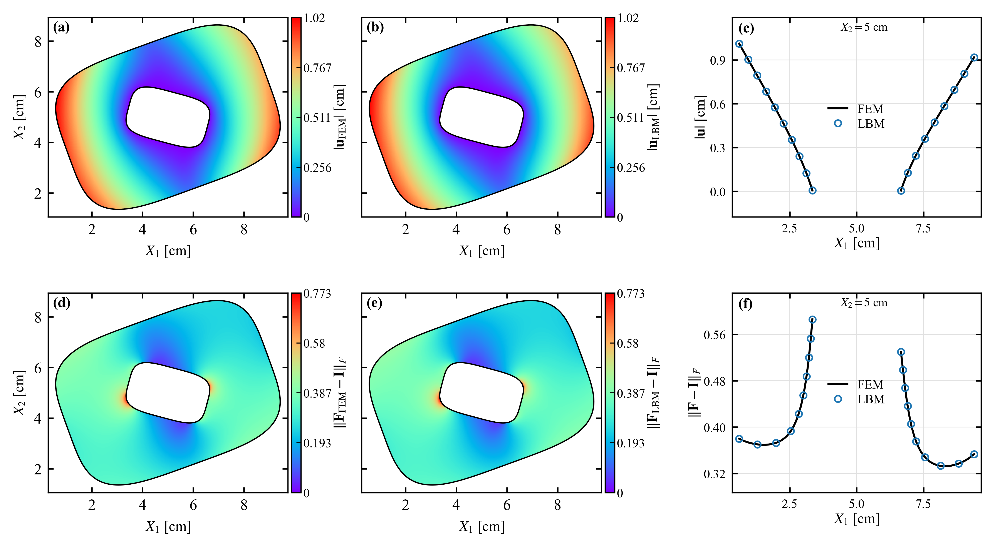
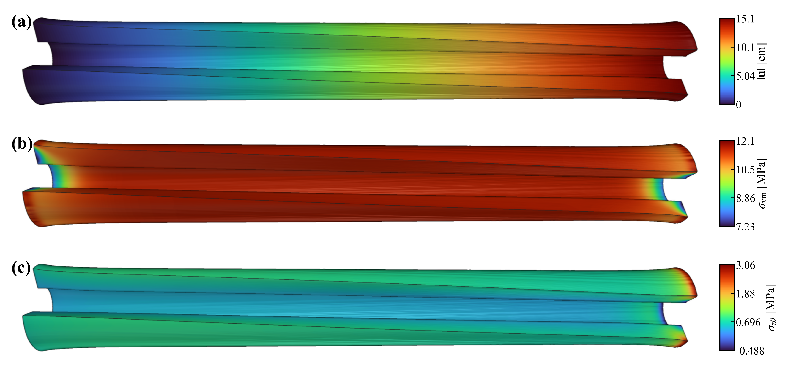

# Curved Boundary VLBM

[](https://github.com/JingsenFeng/curved-boundary-vlbm/actions/workflows/tests.yml)
[](LICENSE)
[](pyproject.toml)
[](https://doi.org/10.5281/zenodo.20572218)

**Finite-strain hyperelasticity on Cartesian lattices with curved material boundaries.**

Research software accompanying *Total-Lagrangian vectorial lattice Boltzmann method
for finite-strain hyperelasticity with curved boundaries*, by **Jingsen Feng and Xu Chu**.
The package provides D2Q4×6 and D3Q6×12 solvers implemented in NVIDIA Warp, the
manuscript benchmarks, FEM reference arrays, and figure-generation scripts.

<p align="center">
  
  
</p>

## Method

The total-Lagrangian state contains material velocity and the deformation gradient.
Vector-valued populations carry the mechanical state and its fluxes on a fixed
reference lattice. A level-set description supplies the embedded material surface,
cut-link intersections, and normals.

- **Velocity Dirichlet boundaries:** population-pair identities and BFL interpolation.
- **Nominal-traction boundaries:** local tangential prediction, a nonlinear normal-traction
  solve, and characteristic reconstruction with the actual BGK relaxation and source terms.
- **Kinematics:** one local displacement sweep and one deformation-gradient update per step;
  gradients use centered or second-order one-sided differences where the stencil permits.
- **Execution:** CPU and CUDA backends, double precision, and fixed spatial neighborhoods.

The algorithm and numerical conventions are described in [Method](docs/method.md).

## Install

Use Python 3.11 and an isolated environment:

```bash
git clone https://github.com/JingsenFeng/curved-boundary-vlbm.git
cd curved-boundary-vlbm
python -m venv .venv
source .venv/bin/activate
python -m pip install --upgrade pip
python -m pip install -e '.[test,render]'
```

The `render` extra supplies PyVista/VTK for the three-dimensional tube figure.
For solver use and numerical tests, `python -m pip install -e '.[test]'` is sufficient.
The solver runs on CPU; full manuscript calculations benefit from an NVIDIA GPU.
Warp compiles its kernels on the first run.

[requirements-reproducible.txt](requirements-reproducible.txt) records the exact numerical
and rendering dependency versions used for the manuscript and release checks. Install
them before the editable package when reproducing that environment.

## Quick start

```bash
# A small two- and three-dimensional calculation; no FEM installation required.
python cases/smoke.py --device cpu

# Numerical boundary, gradient, regression, and plotting checks.
WARP_DEVICE=cpu python -m pytest -q

# Inspect the available manuscript cases and their complete commands.
python cases/reproduce.py --list
python cases/reproduce.py --dry-run --device cuda:0
```

## Reproduce the manuscript

```bash
# All Dirichlet, traction, and mixed-boundary benchmarks, followed by figures.
python cases/reproduce.py --device cuda:0

# Selected cases.
python cases/reproduce.py --cases annulus,shell --device cuda:0

# Regenerate figures from completed simulations.
python cases/reproduce.py --render-only
```

Outputs are written to `results/paper/`. The driver records exact commands,
source hashes, elapsed times, and completion status. It checks positive deformation
Jacobians, finite fields, completed time intervals, and the shared numerical settings.
Use `--root` for a separate output directory and `--rerun` to recompute selected cases.
Full-resolution runs are research workloads; the quick-start example uses small grids.

| Case | Dimension | Boundary/loading | Reference |
|---|---|---|---|
| `affine_annulus` | 2D | Affine velocity on both curved interfaces | Exact solution |
| `annulus` | 2D | Clamped inner wall, radial outer traction | FEM |
| `superellipse` | 2D | Clamped inner wall, outer traction | FEM |
| `pulse2d` | 2D | Clamped disk with a pressure-loaded eccentric hole | Dynamic FEM |
| `ellipsoid` | 3D | Affine velocity on a rotated ellipsoid | Exact solution |
| `shell` | 3D | Spherical shell with nominal traction | Nonlinear radial BVP |
| `tube10`, `tube20`, `tube30` | 3D | End stretch/twist, traction-free curved walls | FEM profiles |

All traction cases use `c=10`, `omega=1.8`, `alpha_u=0.85`, `theta_F=0.5`, and
`w_D=100`, with one displacement sweep and one deformation-gradient update per step.
Equilibrium calculations use damping `gamma=10`; the transient pressure pulse uses `gamma=0`.
The affine Dirichlet benchmarks use their stated exact-solution settings.
See [Benchmarks](docs/benchmarks.md) for grids, loading schedules, units, and individual commands.

The bundled FEM arrays and profiles allow the reported LBM/FEM comparisons without
installing FEniCSx. The planar case scripts also contain the FEM reference solvers.
See [Reference data](docs/reference-data.md) to regenerate them or run modified geometries.

## Repository layout

```text
src/curved_lbm/
  two_d/             D2Q4×6 bulk and curved-boundary solvers
  three_d/           D3Q6×12 solvers and characteristic stencil construction
cases/               Physical benchmarks, common settings, reproduction driver
plotting/            Field maps, line profiles, and figure templates
tests/               Numerical and plotting checks with regression fixtures
reference_data/      FEM arrays, profiles, parameters, and checksums
docs/                Method, reproduction instructions, and reference documentation
validation/          Manuscript metrics and release verification records
scripts/             Release integrity and packaging utilities
```

## Validation and citation

See [Validation](docs/validation.md) for the numerical checks and their scope.
The release passed 27 tests on both CPU and CUDA and completed all 18 manuscript
grid runs; the stored benchmark errors agree with the manuscript to three significant digits.
The complete simulation datasets are available through
[Zenodo](https://doi.org/10.5281/zenodo.20572218).

Please cite the accompanying manuscript and the version of this repository used in
your work. Machine-readable software citation metadata is provided in [CITATION.cff](CITATION.cff).
The underlying total-Lagrangian vectorial formulation is described by Feng and Chu,
[Computer Methods in Applied Mechanics and Engineering, 119347](https://doi.org/10.1016/j.cma.2026.119347).

## License and contributions

Released under the [Apache License 2.0](LICENSE), with attribution in [NOTICE](NOTICE).
For bug reports, include the case command, dependency versions, device, and the
smallest input that reproduces the problem. Contributions should include a numerical
check when they change solver behavior; see [CONTRIBUTING.md](CONTRIBUTING.md).
